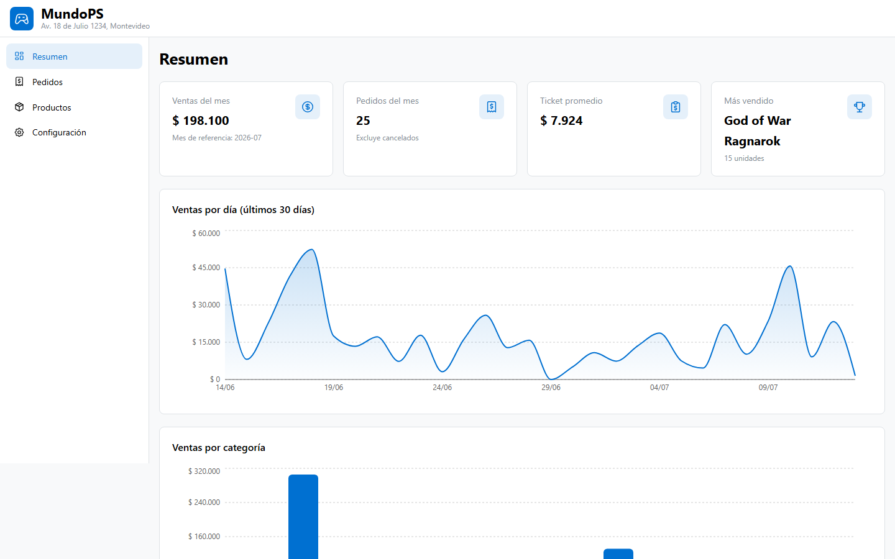

# MundoPS — Store Management Dashboard

Admin dashboard for **MundoPS**, a fictional PlayStation 5 online store based in Montevideo, Uruguay (it mirrors the catalog of [my e-commerce demo site](https://lucashermida.com/e-commerce/inicio)). Fully client-side: all data is simulated with typed mock modules — no backend, no auth, no database.



## Features

- **Overview** — KPI cards (monthly sales, order count, average ticket, top seller) computed from the mock data, plus daily sales and sales-by-category charts.
- **Orders** — filterable table (status filter, debounced customer search, client-side pagination) with a detail drawer and status transitions enforced by a pure function (`pending -> confirmed -> delivered`, cancellable unless delivered).
- **Products** — card grid with offer pricing, low-stock badges and a create/edit modal validated with `@mantine/form` (Spanish error messages, offer price must be below regular price).
- **Settings** — store info form and a live brand-color picker that rebuilds the Mantine theme for the whole app in real time.

## Stack

- [Vite](https://vite.dev/) + [React 18](https://react.dev/) + TypeScript (strict mode)
- [Mantine v7](https://mantine.dev/) for UI components and theming
- [Recharts](https://recharts.org/) for charts
- [React Router v6](https://reactrouter.com/)
- No external state management — `useState` + two small contexts cover this scope
- ESLint + Prettier

## Technical decisions

- **Strictly typed domain.** The whole model lives in [`src/types.ts`](src/types.ts) (union types for order status and product category, `stock: number | null` where `null` means unlimited). No `any` anywhere.
- **Pure business logic, separated from UI.** KPI math ([`src/lib/stats.ts`](src/lib/stats.ts)), status transitions ([`src/lib/orderStatus.ts`](src/lib/orderStatus.ts)), product rules ([`src/lib/productRules.ts`](src/lib/productRules.ts)) and color-scale generation ([`src/lib/color.ts`](src/lib/color.ts)) are plain functions with no React imports — easy to test and to reason about.
- **Deterministic mock data.** ~15 products and 60 orders spread over 30 days in [`src/data/`](src/data/). The dashboard derives "today" from the most recent order instead of `new Date()`, so the demo never renders empty.
- **Dynamic Mantine theming.** `ConfigContext` wraps `MantineProvider`; changing the brand color rebuilds the theme and every component (buttons, badges, charts) picks it up live. A pure function derives the 10-shade Mantine color scale from a single hex.
- **No persistence, on purpose.** Settings and data edits live in React state only. In production they would be persisted to a backend (or at minimum localStorage); keeping the demo stateless makes the mock-data reset behavior explicit.

## Running it

```bash
npm install
npm run dev      # dev server on http://localhost:5173
npm run build    # type-checks and builds to dist/
npm run lint     # eslint
npm run format   # prettier
```

The build output in `dist/` is fully static. Note that routing uses the browser history API, so when hosting (GitHub Pages, Netlify, etc.) configure a SPA fallback to `index.html`.

## About this project

Built as my first React + TypeScript project, coming from a Laravel/Alpine background — using my AI-agent workflow with human review on every piece.
